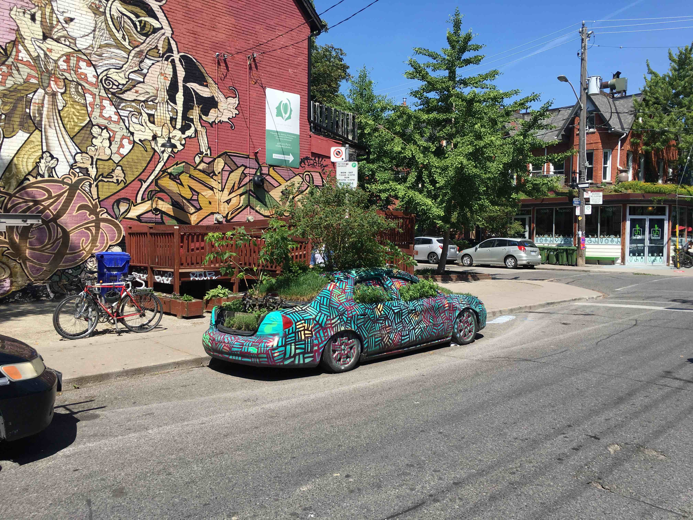
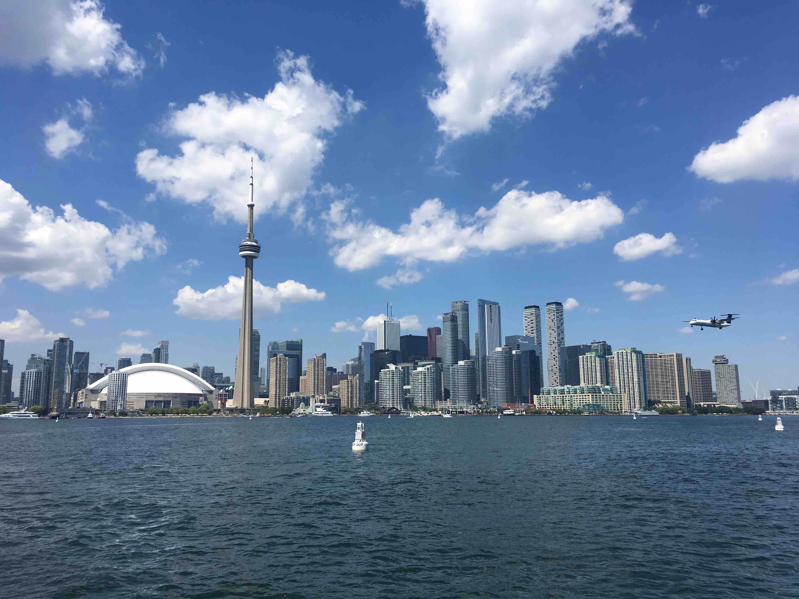

This past week I had the pleasure of visiting Toronto for the first time and experiencing [SmashingConf](https://www.smashingmagazine.com/events/toronto-2018/), and I would like to take some time and share my experiences from the event.  SmashingConf decided to do something rather controversial for this conference by asking all presenters to avoid using PowerPoint slides during their speeches.  A curious decision to be sure, and you could tell immediately that the speakers were out of their comfort zone.  Fortunately speakers operating outside of their comfort zone is something that seemed to only fuel the engagement in the talks.

## The City

Toronto is awesome!  Coming from Chicago I am no stranger to a large, diverse city but Toronto redefined the term _integrated diversity_ for me.  The cultural diversity mixed with the generally relaxed Canadian vibe made for a cool experience.  The city itself was beautiful.  I took the time to explore Toronto for three days after the event with my wife and we made it to the Toronto Islands, Kensington Market, Yorkville, and Old Town.  Every area was super unique, and the fusion of old and new really delivered an intriguing vibe while walking around.  Luckily Thursday and Friday were sunny, 80F days so it was perfect exploring weather. Summer clearly brings the city to life, much like Chicago, and I found myself wondering if I'd ever willingly come visit in the winter.

*A Kensington Market Car Tree.*

## The Environment

The idea to host a conference sans-PowerPoint appeared to be the brain-child of [Vitaly Friedman](https://www.smashingmagazine.com/author/vitaly-friedman/), co-founder of [Smashing Magazine](https://www.smashingmagazine.com/) and the host of SmashingConf.  The conference itself spanned Tuesday, June 26th to Wednesday, June 27th at the [TIFF Lightbox Theater](https://www.google.com/maps/place/TIFF+Bell+Lightbox/@43.6465295,-79.3904082,15z/data=!4m5!3m4!1s0x0:0x4f67cc5a0d114196!8m2!3d43.6465295!4d-79.3904082) in the heart of downtown Toronto.  I attended the conference with [Brittany Mikottis](http://www.mikottisdesign.com/), a Product Designer and [Allison Paul](https://www.linkedin.com/in/allisonpaul/), a UX researcher.  All-in-all there was around 500 people in attendance, and the disciplines seemed to be evenly split between Design and Development, maybe weighing a little heavier on the development side.

## The DJ

 Yeah, that's right. A DJ.  SmashingConf decided to have [DJ Baldower](https://twitter.com/baldower) (a.k.a. Toby Lessnow) in attendance who sat on the stage for the entirety of the event.  He would sample statements from the presentations on stage into the mixes he played during breaks and between speakers.  Admittedly at first I was rather put off by the idea of a DJ at 8:30AM on a Tuesday as we were finding our seats. Then as I watched Toby have fun on stage, and listened to his music, he converted me to a fan within minutes.  How can you not have fun watching this guy do his thing at a tech conference?  

Toby hung out with us for a bit during the after party on Tuesday night and he recounted an inspiring story of coming to America as a 17 year old exchange student. He explained how the experience opened him up to a whole new life-path and inevitably inspired him to become the DJ he is now.  During a time where topics like immigration are so forward in everyones awareness it was inspiring to hear him recount his experiences.  Toby's character was as refreshing as his music, and the conference wouldn't have left as big of an impression without him. Having attended a number of Tony Robbins events, I know how effective music is to keep people awake and help maintain focus for long stretches of sitting. Especially when listening to topics that can be quite dry, even to those of us who are passionate about them.  I hope this becomes a trend.

## The Speakers

The speakers covered a diverse range of topics, and there was a healthy balance between Design and Development with a sprinkling of UX, Performance, & Accessibility.  Admittedly my friends and I had a great time at the afterparty on Tuesday so we were a little late to the conference on Wednesday and we missed the first two speakers. Each individual overcame the no-slide limitation in their own way. I'll just recount a few of the ones that stood out most to me. **Note: I'll add links to the speaker videos once they're published.**

#### Day 1

[Dan Mall](https://twitter.com/danielmall) demonstrated some great approaches to the creative design process and overcoming the challenge of a blank page.  It was humorous watching dan using his Photoshop layers as a replacement for Powerpoint, but as he worked in the tool he used for his job, you got a better impression of how he works which brilliantly captured the essence of why PowerPoint was frowned upon.

[Joe Leech](https://twitter.com/mrJoe) reverted back to his teaching roots when speaking of UX Psychology and used an overhead camera similar to the old-school projectors from my grade school days.  

The two speakers who stole the show for me were [Yiying Lu](https://twitter.com/YiyingLu) and [Aaron Draplin](https://twitter.com/draplin).  To the dismay of Vitaly, these two talks opted for the more traditional PowerPoint format. Regardless the quality of their speaking, and their infectious passion left a lasting impression on me.  These two talks are pretty difficult to sum up in this post (especially Aaron's.  That dude's crazy), but I can say that they have a knack for captivating an audience and delivering their message with quality and conviction. It was during Aaron's talk that I was struck with the absolute realization and inspiration that it was time to stop hiding from my true passion, and to finally pursue starting my own freelance consulting company.  Thank you, Aaron!

#### Day 2

[Gemma O'Brien](https://twitter.com/mrseaves) spoke about lettering design, and essentially turned the stage into a mini art studio.  She borrowed the overhead camera from Joe Leech's talk and brilliantly walked us through the amazing work she did, and then how we can bring the essence of her process into the work we do.  Her creativity was infectious, and the quality of her speech and her work left a lasting impression.

[Eva-Lotta Lamm](https://twitter.com/evalottchen) also used the overhead projector and live-sketched a number of principles, concepts and best-practices in front of us demonstrating how to rapidly prototype features and ideas.  Unfortunately she ran out of time and flew through using the [Amazon Go](https://www.amazon.com/b?ie=UTF8&node=16008589011) store concept as a demonstration for all she taught us during the talk. Eva's talk was very engaging, and I was bummed had to sprint through the closing.  I'm looking forward to seeing her again.

[Seb-Lee Delisle](https://twitter.com/seb_ly) closed out the show with a bang, demonstrating the video games and laser-light shows he's been hacking on for the majority of his career.  His humor was fun, and the stuff he was showcasing was a really inspiring way to close out the show.  This guy basically gets paid to play games with lasers and you can tell he's just having a blast and living his dream.  Just check out this video he shared of a collaboration he did with Val Head syncing visualizations, lasers and music to close out SmashingConf from 2015:

`vimeo: 89624072`

## Conclusion

SmashingConf was a fun, engaging experience and the city of Toronto captivated me.  Contrasted with An Event Apart which I attended in Chicago 2017, I'd say they are doing a great job keeping their brand at the top end of the conference circuit. There was a decent amount of speaker cross-over between the two conferences, so it feels like they are doing their best to nurture the community collaboratively.  I hope this no-slide experiment gets is continued, and we continue finding new and creative ways to communicate with the audience.  My goal for next time is to attend the workshops on day 3 and go deeper into the subjects covered on stage directly with a speaker.  Thank you to SmashingConf and Toronto for reigniting a spark!

