_<b>Note:</b> this is just a couple of examples from my work with Savo and Web2Carz.  I am happy to provide more details and project examples upon request._

## SAVO

My work for SAVO spanned multiple applications and disciplines from 2013 to 2018.  Over the years I performed Development, Product, and UX duties.  I will sample some of the work from our UI/UX team and touch on our collaborative process.

### SAVO Styleguide

Living styleguides help to develop cohesion and alignment in organizations with many teams and large pieces of software. We created our styleguide to support the development of our design principles, design language, UI patterns, Voice & Tone, Ember.js Components, and a number of other benefits.  This was considered a horizontal project for the UI/UX team developed concurrently with more vertical, customer-facing features.

__URL:__ https://savolabs.github.io/savo-styleguide/

#### Screenshots:

<ul class="portfolio-image-list">
  <li>
    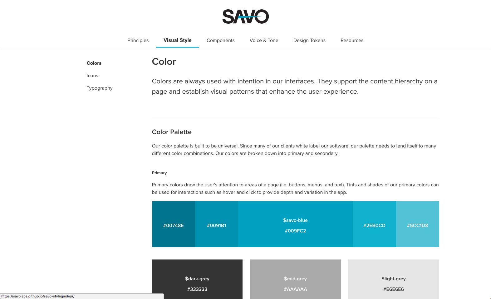
  </li>
  <li>
    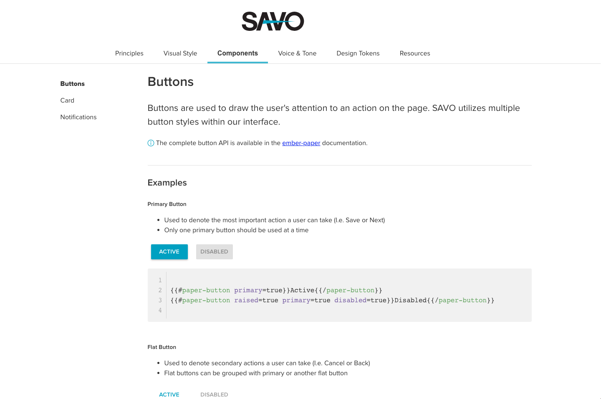
  </li>
  <li>
    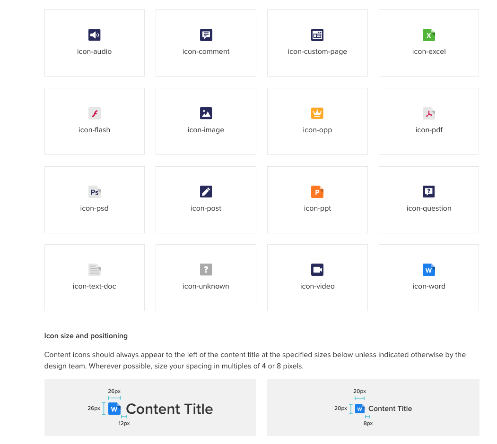
  </li>
  <li>
    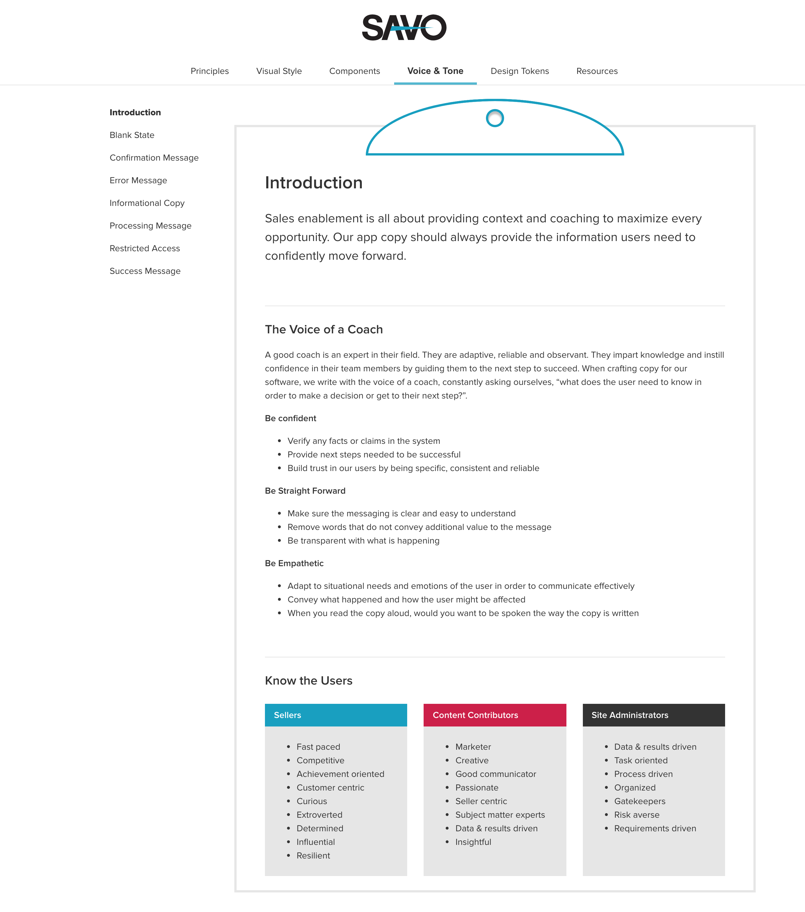
  </li>
</ul>

---

### SAVO Search

Savo's software had become very dated, and the aging interface was costing our sales team deals in the field.  The business came to us asking what the most impactful change was we could make that would delight our users and show them we were reinvesting in our software.  The Search page was our most used page by a large margin, and it was also one of the most technically complex.  

Our team was tasked with redesigning the page while having minimal impact on the technical functionality.  We followed our full process, using cross-disciplinary design studio workshops and iterative user testing.  The final solution was a more modern look and feel, as well as fully responsive on mobile devices.

#### Screenshots:

| Old        | New           |
|:-------------:|:---------------:|
| 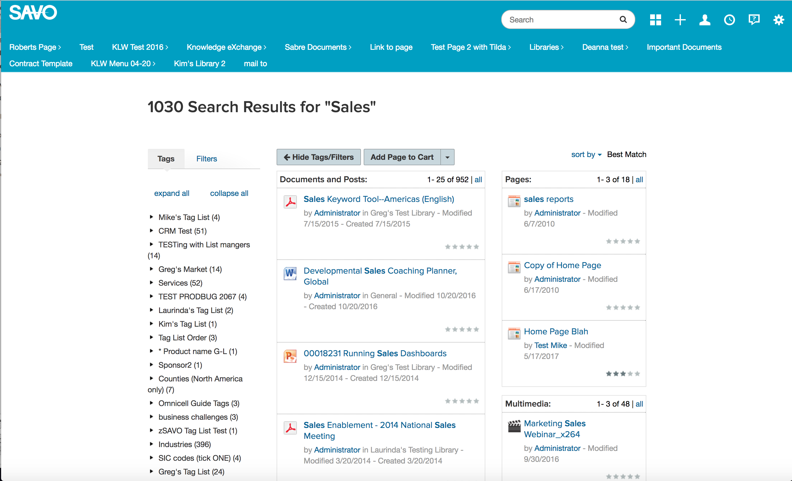 | 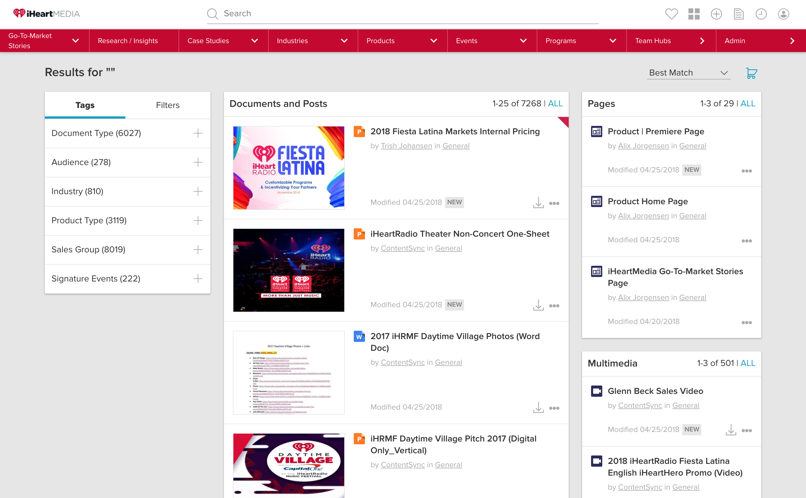 |
| N/A | 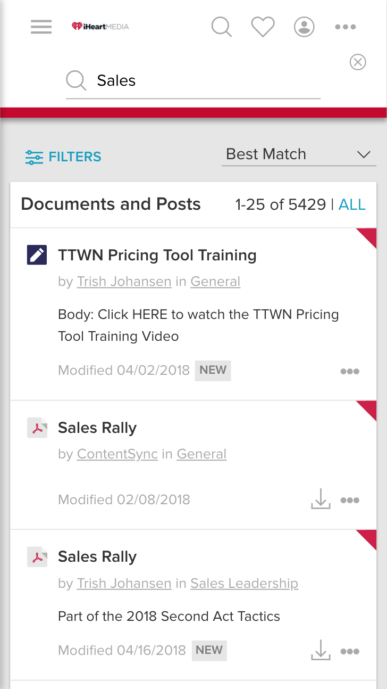 |
| N/A | 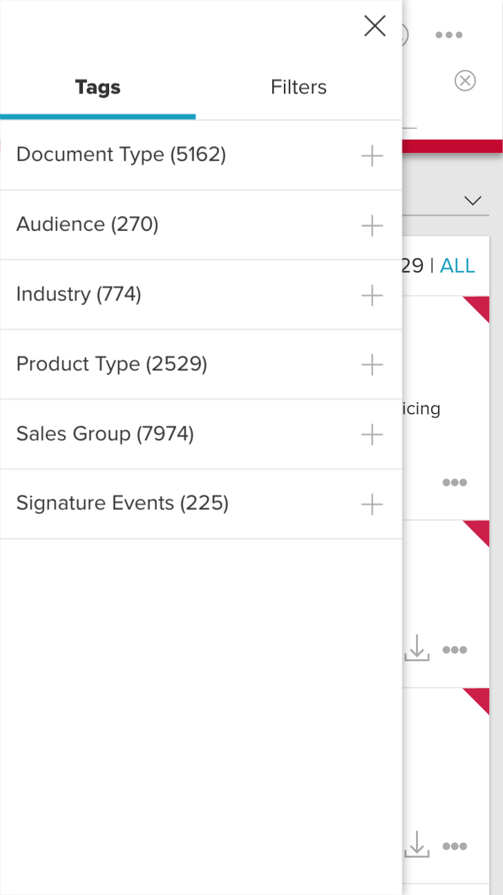 |

---

## Web2Carz.com

In 2011 when Web2Carz brought me in as a Developer, they we're a three-person operation.  As a successful website in the competitive car shopping industry, the founders were ready to grow their business in new directions to maintain an edge. We completely redesigned the website from the ground up, implemented a net-new editorial section, and create a mobile version of the website.

| Old        | New           |
|:-------------:|:-------------:|
| 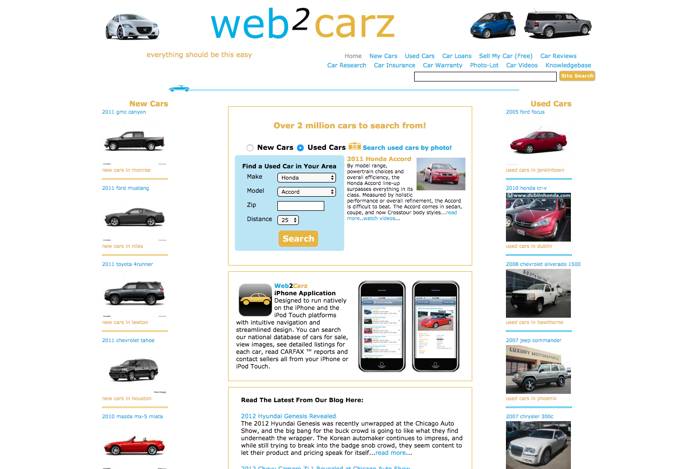 | 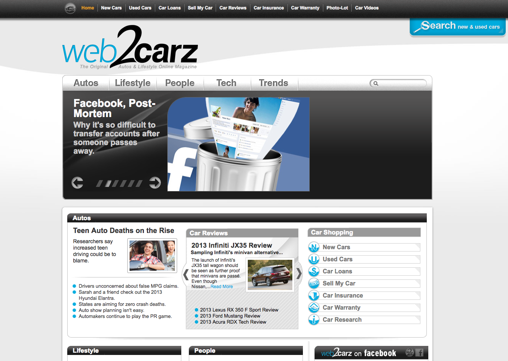 |
| 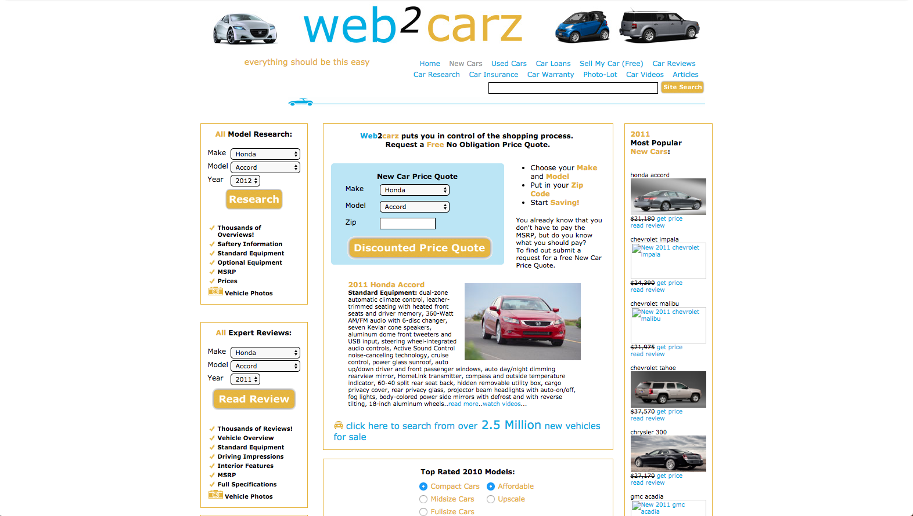 | 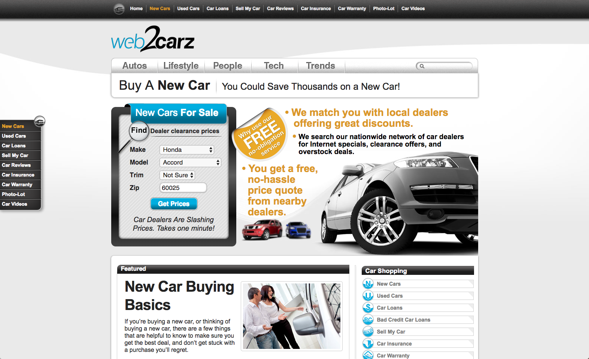 |
| N/A | 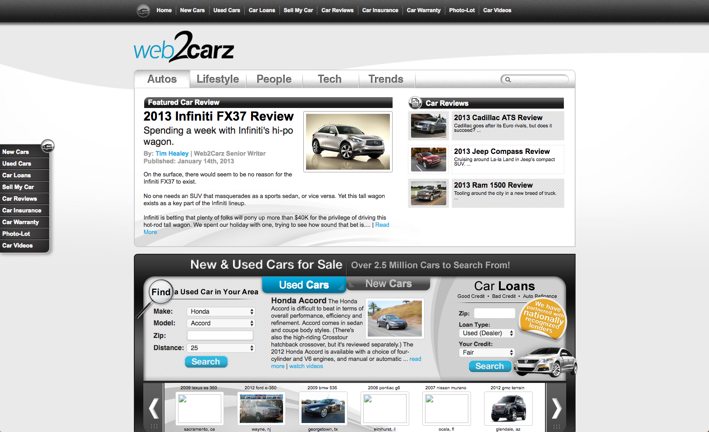 |
